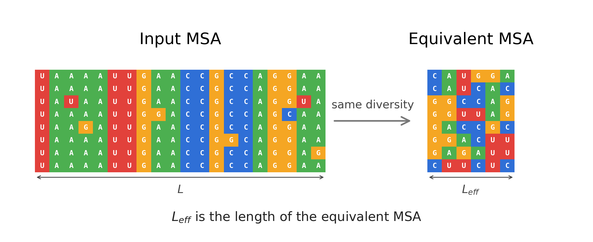

# eff_len



Spectral measure of diversity for multiple sequence alignments.

`L_eff` estimates the diversity, or amount of information, contained in an MSA. It allows a faithful comparison between alignments, and between generated datasets.

## Install

```bash
pip install eff-len
```

## Usage

```python
from eff_len import read_fasta, msa_to_oh, effective_length
```

Or in command line:

```console
$ eff_len data/test/RF00028.fa --fmt fasta --stype nuc
data/test/RF00028.fa
  sequences   N       = 2611
  length      L       = 251
  effective   L_eff   = 35.88
  normalised  L_eff/L = 0.143
  support     log10 W = 25.08
```

### RNA

```python
msa = read_fasta("data/test/RF00028.fa", seq_type="nuc")
msa_oh = msa_to_oh(msa, seq_type="nuc")

N, L, k = msa_oh.shape
L_eff = effective_length(msa_oh)

print(N, L, L_eff, L_eff / L)
# 2611 251 35.88477058938092 0.14296721350350963
```

### Protein

```python
msa = read_fasta("data/test/PF00636.25.fa", seq_type="prot")
msa_oh = msa_to_oh(msa, seq_type="prot")

N, L, k = msa_oh.shape
L_eff = effective_length(msa_oh)

print(N, L, L_eff, L_eff / L)
# 230 377 6.597405579230785 0.01749974954703126
```

### a3m files

`read_fasta` also reads `.a3m` and `.a2m`, as produced by HHblits, MMseqs2 and ColabFold. Lowercase insertion columns are removed automatically.

```python
msa = read_fasta("query.a3m", seq_type="prot")
```

### Comparing two alignments

```python
from eff_len import cross_effective_length

cross_effective_length(msa_oh_a, msa_oh_b)
```

## Reproducing the paper

Code for the figures in *"A spectral framework for measuring diversity in multiple sequence alignments"* is in `reproducibility.org`.

Data were extracted from:

- C. Lambert *et al.* (2025) *Nat. Commun.*
- F. Calvanese *et al.* (2024) *NAR*
- M. Mirdita *et al.* (2017) *NAR*

## License

MIT
